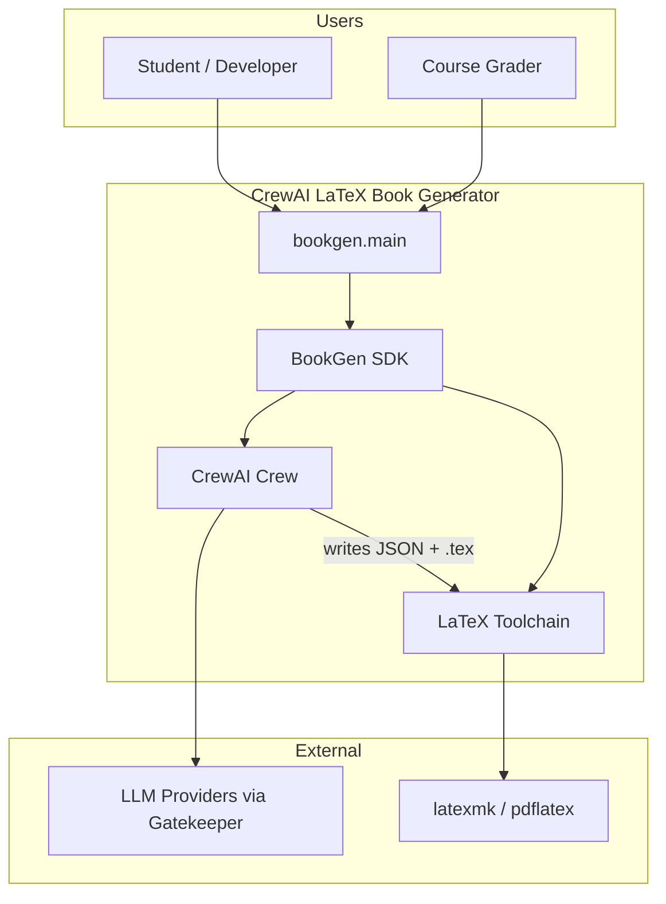
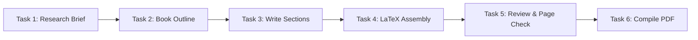
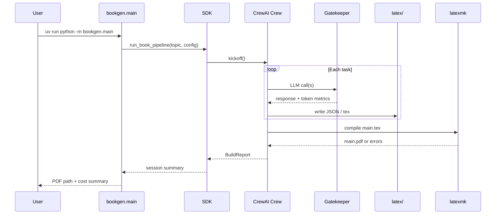

# Implementation Plan — CrewAI LaTeX Book Generator

**Project:** Exercise 03 — Intelligent Agents  
**Version:** 0.10 (planning draft)  
**Authors:** Renat Karimov, Alon Engel  
**Last updated:** 2026-06-09

---

## 1. Purpose

This document describes **how** we build the Ex03 system: CrewAI crew design, LaTeX pipeline, Python architecture, and delivery phases. It complements `PRD.md` (what) with technical decisions traceable to **Guidelines V3** and the course agent-architecture materials.

---

## 2. System context (C4 — Level 1)



---

## 3. Container view (C4 — Level 2)

| Container | Location | Responsibility |
|-----------|----------|----------------|
| CLI entry | `bookgen.main` | Args, config load, session lifecycle |
| SDK facade | `bookgen.sdk` | Single entry: `run_book_pipeline()`, `compile_pdf()` |
| Crew builder | `bookgen.crew.factory` | Instantiates agents, tasks, Crew |
| Agent defs | `bookgen.crew.agents` | Role, goal, backstory, tools list |
| Task defs | `bookgen.crew.tasks` | Ordered tasks + context deps |
| Schemas | `bookgen.models` | Pydantic: ResearchBrief, Outline, SectionDraft, ReviewReport |
| LaTeX writer | `bookgen.latex.writer` | JSON → `.tex` fragments |
| LaTeX build | `bookgen.latex.compiler` | Invoke latexmk, capture logs |
| Gatekeeper | `bookgen.shared.gatekeeper` | Rate limits, queue, retry |
| LLM SDK | `bookgen.sdk.llm_client` | Unified provider calls |
| Logging | `bookgen.logging_setup` | JSONL crew + token metrics |
| Config | `bookgen.shared.config` | Load JSON configs + version check |

---

## 4. CrewAI agent architecture (core design)

### 4.1 Design principles

1. **Organization model (CrewAI Part A):** Each agent = job title in a publishing house.
2. **Workflow chain (CrewAI Part B):** Strict handoffs; no agent edits another’s file directly without Reviewer approval metadata.
3. **Structured outputs:** JSON schemas between tasks — avoids broken LaTeX from prose drift.
4. **Modular instructions:** Agent prompts live in `config/prompts/<role>.yaml` (versioned), not hardcoded in Python.
5. **Production layers (Architecture 2026):** Planner = Outline Architect; Memory = session JSONL + outline artifact; Tools = search stub, file write, latex compile; Observability = gatekeeper logs + cost.

### 4.2 Agent roster

| Agent | Role metaphor | Goal (summary) | Key constraints |
|-------|---------------|----------------|-----------------|
| **Research Director** | Chief researcher | Produce annotated source brief from topic + course materials | Min 8 claims with source tags; flag controversies |
| **Outline Architect** | Structural editor | Turn brief into 5–7 chapter outline with page budget | Must sum to ~15 pages; learning objectives per chapter |
| **Chapter Writer** | Technical author | Write section bodies as structured LaTeX-safe paragraphs | No `\begin{document}`; escape special chars; cite keys |
| **LaTeX Editor** | Copy editor + TeX expert | Merge sections, fix consistency, generate `main.tex` glue | Enforce terminology glossary; resolve duplicate labels |
| **Build Engineer** | DevOps publisher | Compile PDF, parse errors, return fix list | Max 3 compile attempts; never skip bib pass |

### 4.3 Task graph (sequential crew)



| Task | Agent | Output artifact | Stored path |
|------|-------|-----------------|-------------|
| 1 — Research | Research Director | `ResearchBrief` JSON | `data/sessions/<id>/01_research.json` |
| 2 — Outline | Outline Architect | `BookOutline` JSON | `data/sessions/<id>/02_outline.json` |
| 3 — Draft | Chapter Writer | `SectionDraft[]` JSON | `data/sessions/<id>/03_sections.json` |
| 4 — Assemble | LaTeX Editor | `.tex` files | `latex/chapters/*.tex`, updates `latex/main.tex` |
| 5 — Review | LaTeX Editor | `ReviewReport` JSON | `data/sessions/<id>/05_review.json` |
| 6 — Build | Build Engineer | PDF + build log | `latex/build/main.pdf`, `logs/latex/` |

**CrewAI process:** `Process.sequential` (default).  
**Rationale:** Grader can replay logs in order; easier than hierarchical manager for homework audit.

**Stretch (optional):** `Process.hierarchical` with a **Publishing Manager** agent delegating to sub-crew — only if team documents trade-off in ADR-003.

### 4.4 Agent instruction templates (sketch)

#### Research Director
```
You are the Research Director for a technical book on {topic}.
Deliver ONLY valid JSON matching ResearchBrief schema.
Rules:
- Include course concepts: LangChain vs LangGraph, CrewAI teams, MCP/A2A, production gaps.
- Each finding: claim, evidence_summary, source_tag (course_pdf | external | team_analysis).
- Add a "team_analysis" section with OUR original comparison — not slide paraphrase.
- Max 1200 words in brief.
```

#### Outline Architect
```
Convert ResearchBrief into BookOutline JSON.
Rules:
- 5–7 chapters, target_total_pages = 15 (±1).
- Allocate page_budget per chapter; sum must equal target.
- Each chapter: title, learning_objectives[], section_titles[], key_terms[].
- Chapter 1 must frame "prompt ≠ production agent".
```

#### Chapter Writer
```
For each outline section, produce SectionDraft JSON entries.
Rules:
- body_paragraphs[]: plain text with inline \\cite{key} markers only.
- No markdown (#, **). No raw LaTeX environments except inline math $...$.
- 500–900 words per chapter unless page_budget dictates otherwise.
```

#### LaTeX Editor
```
Merge SectionDraft[] into valid LaTeX chapter files.
Rules:
- Escape: % $ # _ { } ~ ^ \\ 
- Use \\section, \\subsection only (article class).
- Write latex/chapters/chNN_<slug>.tex and update \\include list in main.tex.
- Output ReviewReport with estimated_pages, glossary, fix_list[].
```

#### Build Engineer
```
Compile latex/main.tex using the latex_compile tool.
Rules:
- On failure: parse .log for missing citations, undefined refs, Unicode errors.
- Return structured BuildReport with success, pdf_path, attempts, errors[].
- Do NOT hallucinate success — pdf must exist on disk.
```

### 4.5 Tools per agent

| Tool | Agents | Implementation |
|------|--------|----------------|
| `load_course_context` | Research Director | Reads indexed snippets from `material/` (optional RAG stub) |
| `write_session_artifact` | All | Writes JSON to session dir |
| `write_tex_file` | LaTeX Editor | Writes under `latex/` with path guard |
| `latex_compile` | Build Engineer | Subprocess `latexmk -pdf -interaction=nonstopmode` |
| `estimate_pages` | LaTeX Editor | Heuristic: words / 350 + figures allowance |

All tools implemented as CrewAI `@tool` wrappers calling SDK functions (testable without LLM).

### 4.6 Data schemas (Pydantic sketch)

```python
# bookgen/models/research.py
class Finding(BaseModel):
    claim: str
    evidence_summary: str
    source_tag: Literal["course_pdf", "external", "team_analysis"]

class ResearchBrief(BaseModel):
    topic: str
    thesis: str
    findings: list[Finding]
    open_questions: list[str]
    version: str = "1.0"

# bookgen/models/outline.py
class ChapterPlan(BaseModel):
    number: int
    title: str
    page_budget: float
    learning_objectives: list[str]
    section_titles: list[str]

class BookOutline(BaseModel):
    title: str
    target_total_pages: int = 15
    chapters: list[ChapterPlan]

# bookgen/models/draft.py
class SectionDraft(BaseModel):
    chapter_number: int
    section_title: str
    body_paragraphs: list[str]
    citations: list[str]  # bib keys

# bookgen/models/review.py
class ReviewReport(BaseModel):
    estimated_pages: float
    issues: list[str]
    approved: bool
    glossary: dict[str, str]
```

---

## 5. LaTeX project structure

```
latex/
├── main.tex              # \documentclass{article}, includes chapters
├── preamble.tex          # packages, typography, hyperref
├── metadata.tex          % title, author, date
├── chapters/
│   ├── ch01_intro.tex
│   ├── ch02_langchain_graph.tex
│   ├── ch03_crewai_teams.tex
│   ├── ch04_production_runtime.tex
│   ├── ch05_protocols_cost.tex
│   └── ch06_future.tex
├── references.bib
├── figures/              # optional diagrams exported from Mermaid
└── build/                # gitignored PDF + aux files
```

**Document class:** `article` 11pt A4, `geometry` margin 2.5cm → ~450 words/page → 15 pages ≈ 6,000–6,750 words.

---

## 6. Python package layout (target)

```
project-root/
├── src/bookgen/
│   ├── main.py
│   ├── sdk/
│   │   ├── sdk.py
│   │   └── llm_client.py
│   ├── crew/
│   │   ├── factory.py
│   │   ├── agents.py
│   │   └── tasks.py
│   ├── latex/
│   │   ├── writer.py
│   │   └── compiler.py
│   ├── models/
│   ├── shared/
│   │   ├── gatekeeper.py
│   │   └── config.py
│   └── logging_setup.py
├── tests/unit/ ...
├── tests/integration/test_pipeline_dry_run.py
├── config/
│   ├── setup.json
│   ├── rate_limits.json
│   ├── book.json
│   └── prompts/
├── latex/                  # full LaTeX project (required submission)
├── docs/                   # PRD, PLAN, TODO, mechanism PRDs
├── data/sessions/            # gitignored run artifacts (keep samples/)
├── logs/
├── README.md
├── pyproject.toml
└── uv.lock
```

---

## 7. Sequence diagram — happy path



---

## 8. Configuration

### `config/book.json` (sketch)
```json
{
  "version": "1.00",
  "topic": "AI Agent Architectures in 2026: From Prompt Chains to Production Crews",
  "target_pages": 15,
  "page_tolerance": 1,
  "demo_mode": {
    "chapters": 2,
    "max_sections_per_chapter": 2
  },
  "latex": {
    "main_file": "latex/main.tex",
    "build_dir": "latex/build",
    "max_compile_attempts": 3
  }
}
```

---

## 9. ADRs (Architecture Decision Records)

### ADR-001 — CrewAI sequential vs hierarchical
- **Decision:** Sequential process for v1.
- **Reason:** Auditable task order for grading; simpler debugging.
- **Consequence:** Longer wall-clock; acceptable for batch homework pipeline.

### ADR-002 — JSON handoffs vs raw LaTeX between agents
- **Decision:** JSON between agents; LaTeX Editor is sole `.tex` author.
- **Reason:** Reduces compile errors from malformed TeX in writer outputs.
- **Consequence:** Extra parsing layer; covered by unit tests.

### ADR-003 — Single Chapter Writer loop vs per-chapter agents
- **Decision:** One Chapter Writer agent iterates sections in code-controlled loop.
- **Reason:** Stays within 5-agent roster; avoids agent sprawl.
- **Consequence:** Loop logic in orchestrator, not CrewAI dynamic crew.

### ADR-004 — Reuse Ex02 Gatekeeper + SDK patterns
- **Decision:** Port `ApiGatekeeper` and provider facade from Ex02 codebase.
- **Reason:** Proven compliance with Guidelines V3; grader familiarity.

---

## 10. Testing strategy

| Layer | Tests |
|-------|-------|
| Models | Schema validation, edge cases (bad JSON fixtures) |
| LaTeX writer | Escaping, `\cite{}` preservation, path guards |
| Compiler | Mock subprocess; error log parser |
| Gatekeeper | Rate limit, queue FIFO |
| Crew | Dry-run with mocked LLM returning fixtures |
| Integration | `--dry-run` + `--demo` end-to-end without paid API |

**TDD order:** models → writer → compiler → gatekeeper → crew factory → integration.

---

## 11. Delivery phases

| Phase | Deliverable | Owner |
|-------|-------------|-------|
| **P0 Planning** | PRD, PLAN, TODO, mechanism PRDs | Both |
| **P1 Scaffold** | uv project, config, empty LaTeX shell | Renat |
| **P2 SDK + Gatekeeper** | Port from Ex02, tests | Alon |
| **P3 Crew** | Agents, tasks, prompts, dry-run | Both |
| **P4 LaTeX pipeline** | Writer + compiler + sample chapter | Renat |
| **P5 Full run** | 15-page PDF, cost log | Both |
| **P6 Hardening** | Coverage, Ruff, README screenshots | Both |
| **P7 Submit** | Moodle PDF + GitHub tag `ex03-v1.00` | Both |

---

## 12. Cost & observability

Track per agent/task in `logs/crew_run_<id>.jsonl`:

```json
{
  "event": "llm_call",
  "agent": "outline_architect",
  "task": "book_outline",
  "model": "claude-sonnet-4-20250514",
  "input_tokens": 4200,
  "output_tokens": 980,
  "estimated_usd": 0.04
}
```

Publish rollup table in README (Guidelines §11).

---

## 13. Originality hooks (for high grade)

Include a dedicated subsection **"Team Analysis"** (authored in Research + Writer passes):

1. Compare **Ex02 debate orchestrator** (multiprocess IPC) vs **CrewAI role teams** — when to use which.
2. Map course **Command → Skill → Agent** ladder to this project's prompt YAML files.
3. Document one **failed compile iteration** and how Build Engineer recovered (observability story).

These sections differentiate the submission from slide summaries.
