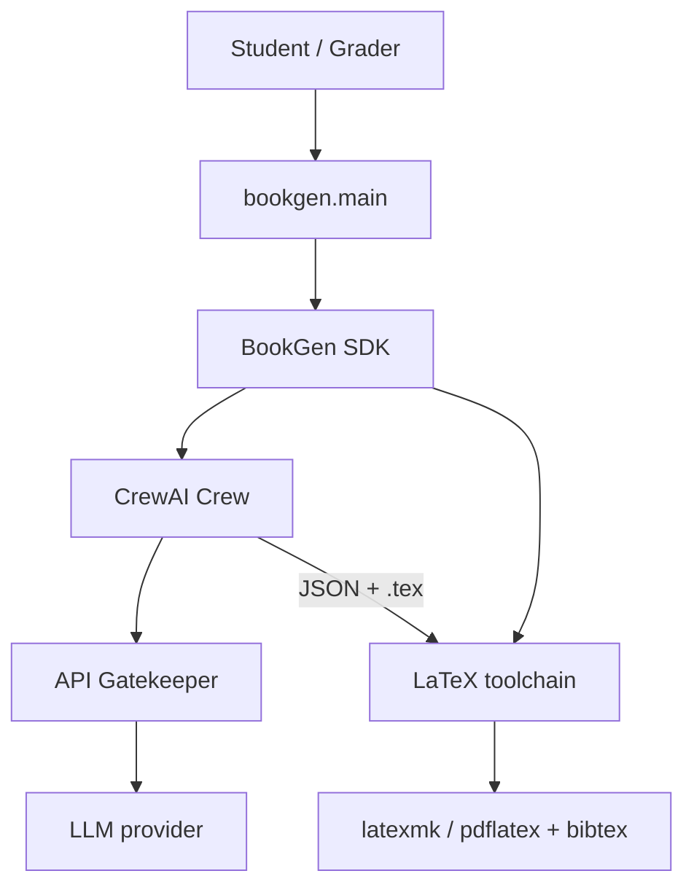
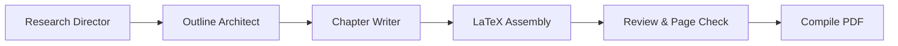
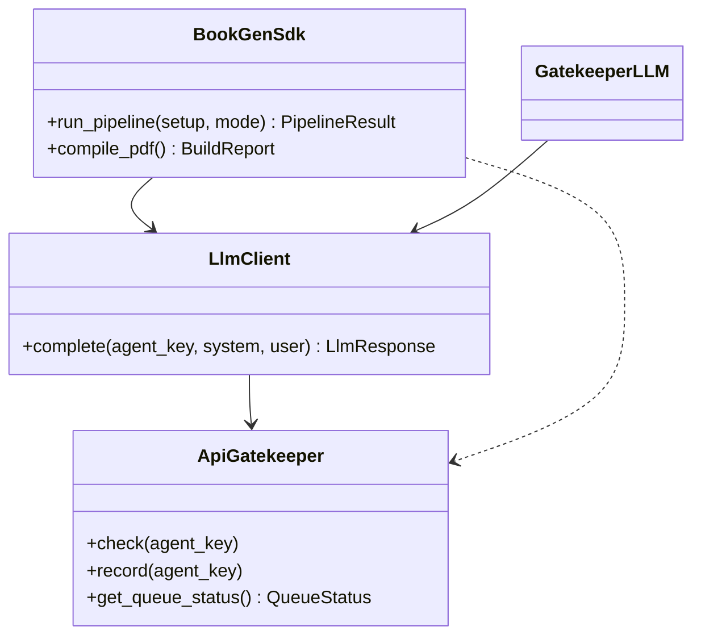
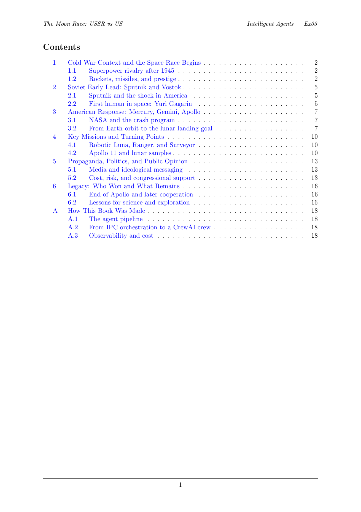
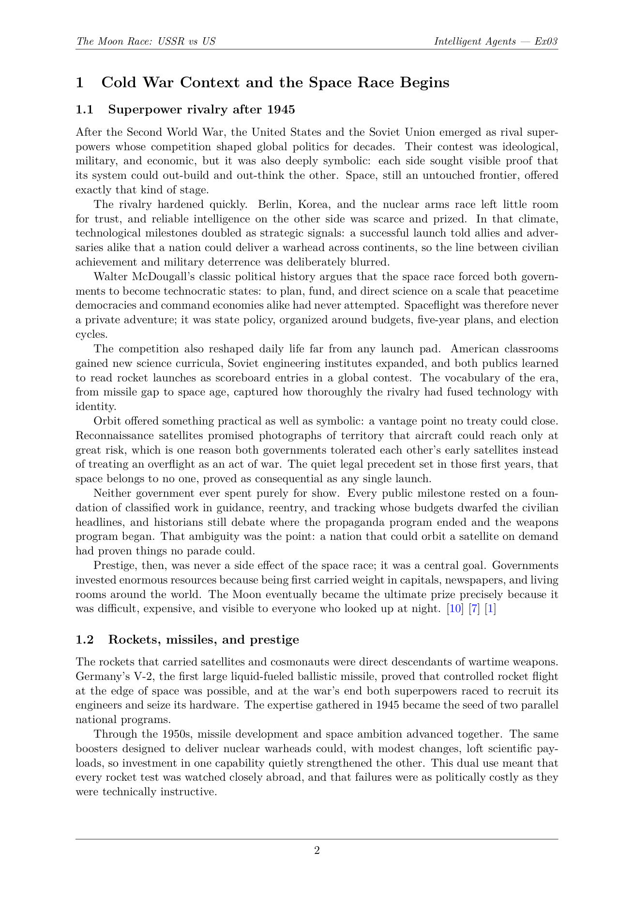
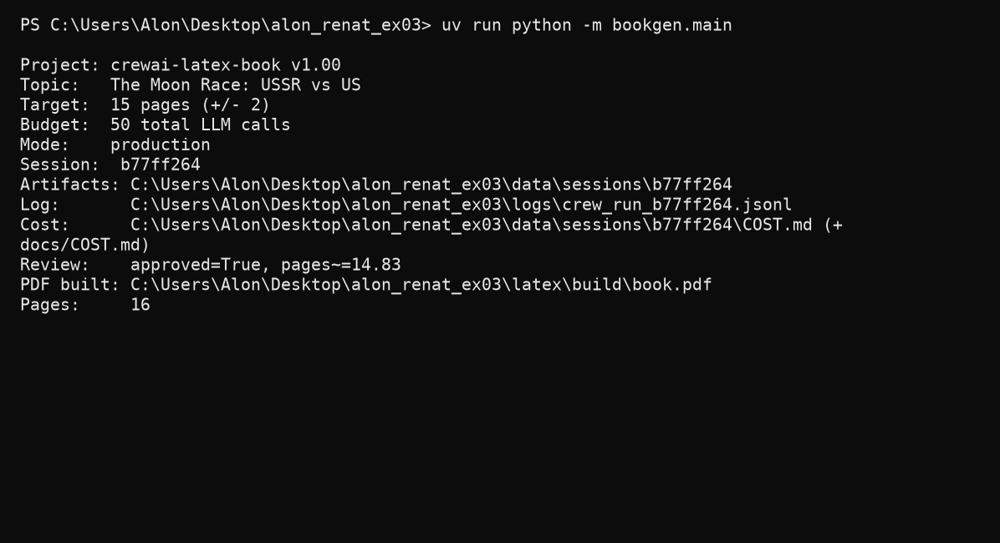

# CrewAI LaTeX Book Generator

**Intelligent Agents — Exercise 03** · University of Haifa
**Renat Karimov** & **Alon Engel** · Group code `anrbj666`
**Course instructor:** Dr. Yoram Segal

A CrewAI multi-agent pipeline that produces a LaTeX book whose **subject chapters alone fill ≥15 pages** (≈20 pages total with cover, TOC, appendix, and bibliography) and compiles it to PDF.

**Book topic:** *The Moon Race: USSR vs US* — from Sputnik and Gagarin through Apollo 11 to the legacy of superpower competition in space.

---

## What this project does

1. A **CrewAI crew** (research → outline → chapters → review → build) maps each agent to a job title in a publishing house.
2. Python **assembles LaTeX** chapter files deterministically from structured (Pydantic) data — no hallucinated `.tex`.
3. **latexmk / pdflatex + bibtex** compiles the book to **`latex/build/book.pdf`** (≥15 subject pages, multiple passes so the TOC and citations resolve).

The default run uses **offline production fixtures** ($0, no API keys, bundled NASA images). Use `--live` when you want the crew to write the content via an LLM.

---

## Architecture

### System context (C4 level 1)



### Agent pipeline (sequential crew)



### Object-oriented layering (SDK is the single entry point)



All business logic is reachable through `BookGenSdk`; CLI, crew, and tools delegate to it. Every LLM call is routed through `ApiGatekeeper` (rate-limit waiting + budget cost-guard + JSONL cost logging). The diagrams above are also reproduced inside the book itself (Appendix A, drawn with **TikZ**).

---

## Installation

Requirements:

| Tool | Purpose |
|------|---------|
| **Python 3.11–3.13** | CrewAI does not support 3.14 |
| **uv** | Package manager + task runner (required by the guidelines) |
| **MiKTeX or TeX Live** | Compile LaTeX to PDF (`latexmk`/`pdflatex` + `bibtex` on `PATH`) |

```bash
# from the repository root
uv sync                      # create the environment and install dependencies
cp .env-example .env         # only needed for --live runs (add an API key)
```

> The virtual environment is created by `uv` and is **not** committed (`.gitignore`).
> The first LaTeX build may take a few minutes while MiKTeX auto-installs packages
> (babel/hebrew, tikz, etc.).

---

## Usage

```bash
uv run python -m bookgen.main              # generate chapters + figures, then compile
uv run python -m bookgen.main --dry-run    # validate configs only (no build)
uv run python -m bookgen.main --demo       # quick 2-chapter smoke test
uv run python -m bookgen.main --compile-only   # recompile existing .tex (after editing)
uv run python -m bookgen.main --live       # crew writes content via an LLM (needs API key, costs money)
```

Fixtures/demo runs compile the canonical **`latex/build/book.pdf`**.
**`--live` runs are isolated:** each one stages a copy of the LaTeX sources into
**`examples/<topic>-<timestamp>/`** (own `book.pdf`, chapters, session JSON,
JSONL log, `COST.md`), so the canonical tree is never overwritten or locked and
every live run is preserved as a self-contained example.

> Close `latex/build/book.pdf` in your PDF viewer before recompiling the
> canonical book, or the build reports "close the file" (Windows locks open PDFs).

### Compiler choice

The pipeline calls **`latexmk`** when available and otherwise falls back to
**`pdflatex` + `bibtex`** (both ship with MiKTeX/TeX Live). LuaLaTeX/XeLaTeX also
work for the Hebrew blocks; the toolchain is configurable in `config/book.json`.

---

## Configuration

| File | Key settings |
|------|--------------|
| `config/setup.json` | `version`, project name, log/session dirs |
| `config/book.json` | `topic`, `target_pages` (15 **subject** pages, hard floor), `page_tolerance` (2), `words_per_page` (280, calibrated — see `notebooks/`), optional `extras` block (figures / Hebrew summaries / table-equation-plot chapters) for a custom subject |
| `config/rate_limits.json` | `version`, per-agent budgets, `requests_per_minute` (→ inter-call wait), `retry_after_seconds`/`max_retries` (transient-failure retry), `timeout_seconds` |
| `config/prompts/*.yaml` | Agent role / goal / backstory / instructions |

**Generic subjects:** change `topic` and (optionally) provide an `extras` block
with your own figure files/URLs and Hebrew chapter summaries — the pipeline
falls back to the built-in Moon Race plan when `extras` is absent. Live runs
generate per-chapter Hebrew summaries from the outline automatically.

All config files declare `"version": "1.00"`, validated at startup against `src/bookgen/shared/version.py`.

---

## Repository layout

```
crewai-latex-book-ex03/
├── assets/chapter-figures/  # bundled NASA images (offline-first)
├── assets/screenshots/      # PDF + pipeline screenshots (submission evidence)
├── config/                  # setup/book/rate_limits + prompt YAMLs
├── docs/                    # PRD, PLAN, TODO, PROMPTS, COST, mechanism PRDs
├── examples/                # one self-contained folder per --live run (pdf + session + cost)
├── latex/                   # LaTeX project (main, preamble, chapters, appendix, bib)
│   └── build/book.pdf       # compiled output
├── notebooks/               # words-per-page calibration analysis
├── src/bookgen/             # Python package (sdk, crew, latex, reporting, shared)
└── tests/                   # unit + integration tests
```

---

## Quality

| Check | Command | Status |
|-------|---------|--------|
| Lint | `uv run ruff check .` | 0 violations (E,F,W,I,N,UP,B,C4,SIM) |
| Tests + coverage | `uv run pytest --cov=src/bookgen` | ≥85% (currently ~88%) |
| File size | — | every source file ≤150 code lines |

Tests are fully offline: HTTP providers use `httpx.MockTransport`, image fetching is
injected, and the pipeline runs in fixtures mode with the compile step swapped out.

---

## API usage & cost

Every LLM call is logged to `logs/crew_run_<id>.jsonl` and summarized in
[`docs/COST.md`](docs/COST.md) (auto-written each run).

| Run mode | Measured cost (see [`docs/COST_live.md`](docs/COST_live.md)) |
|----------|--------------|
| `--demo` / default production | **$0.00** (offline fixtures) |
| `--live`, Claude Opus 4.8 | **$0.5019** — 20-sheet book, 16 subject pages, all sources cited, in `examples/` |
| `--live`, Gemini Flash Lite (free tier) | **$0.00** actual (≈$0.02 paid-tier equivalent) |

---

## Screenshots

Submission evidence lives in [`assets/screenshots/`](assets/screenshots/).

**Table of contents** (rendered from `latex/build/book.pdf`):



**A chapter page** — distinct prose, blue linked citations, a table, and a right-to-left
Hebrew summary block (BiDi):



**Production pipeline run** (`uv run python -m bookgen.main`, offline fixtures, $0):



---

## Documentation

- [PRD](docs/PRD.md) · [PLAN](docs/PLAN.md) (C4 + ADR-001…007) · [TODO](docs/TODO.md)
- [PROMPTS](docs/PROMPTS.md) (prompt-engineering log) · [COST](docs/COST.md) (auto-generated) · [COST_live](docs/COST_live.md) (real live-run evidence incl. failed tests)
- Mechanism PRDs: [crew](docs/PRD_crew_orchestrator.md), [latex](docs/PRD_latex_pipeline.md), [gatekeeper](docs/PRD_gatekeeper.md), [llm sdk](docs/PRD_llm_sdk.md)
- **Live-run example:** [`examples/the_moon_race_ussr_vs_us-20260612-233248/`](examples/the_moon_race_ussr_vs_us-20260612-233248/) — Claude Opus 4.8, 20-sheet book with 16 subject pages, all sources cited, $0.5019 (own `book.pdf`, chapters, session JSON, log, cost report)

---

## Contributing

Coding standards for this repository (the same checks a grader runs):

- **Lint:** `uv run ruff check .` must report zero violations (ruleset `E,F,W,I,N,UP,B,C4,SIM`; `E501` is handled by the formatter).
- **Tests first (TDD):** every module has a matching test under `tests/`; keep coverage ≥85% (`uv run --extra dev pytest --cov=src/bookgen`).
- **File size:** ≤150 code lines per file — split helpers or data into new modules instead of padding.
- **Architecture:** all business logic behind `BookGenSdk`; every LLM call through `ApiGatekeeper`; no hard-coded values (read `config/*.json`); no secrets in code (`.env` only).
- **Versioning:** bump `src/bookgen/shared/version.py` and the `version` key in each config together.
- **Git:** small, descriptive commits; everything runs through `uv` (never `pip`/`venv` directly).

---

## License & credits

Released under the [MIT License](LICENSE) — © 2026 Renat Karimov & Alon Engel.

**Built with:** [CrewAI](https://github.com/crewAIInc/crewAI) (agent orchestration), [Pydantic](https://docs.pydantic.dev/) (schemas), [httpx](https://www.python-httpx.org/) (HTTP), [structlog](https://www.structlog.org/) (logging), [matplotlib](https://matplotlib.org/) (the Python-generated figure), [pypdf](https://pypdf.readthedocs.io/) (page counting), and the [LaTeX](https://www.latex-project.org/) toolchain via **MiKTeX / TeX Live** (TikZ, `babel`-hebrew).

**Images:** chapter photographs are NASA imagery (public domain). **Course:** Intelligent Agents, University of Haifa — Dr. Yoram Segal.

---

## Submission checklist

- [x] `latex/` committed (sources + `figures/` + `build/book.pdf`)
- [x] `docs/PRD.md`, `PLAN.md`, `TODO.md`, `PROMPTS.md`, root `README.md`
- [x] Screenshots added under `assets/screenshots/`
- [ ] GitHub shared with `rmisegal@gmail.com` (or public)
- [ ] Moodle PDF `anrbj666-ex03.pdf` from the Word template (separate from `book.pdf`)
- [ ] Self-grade submitted on Moodle
```
