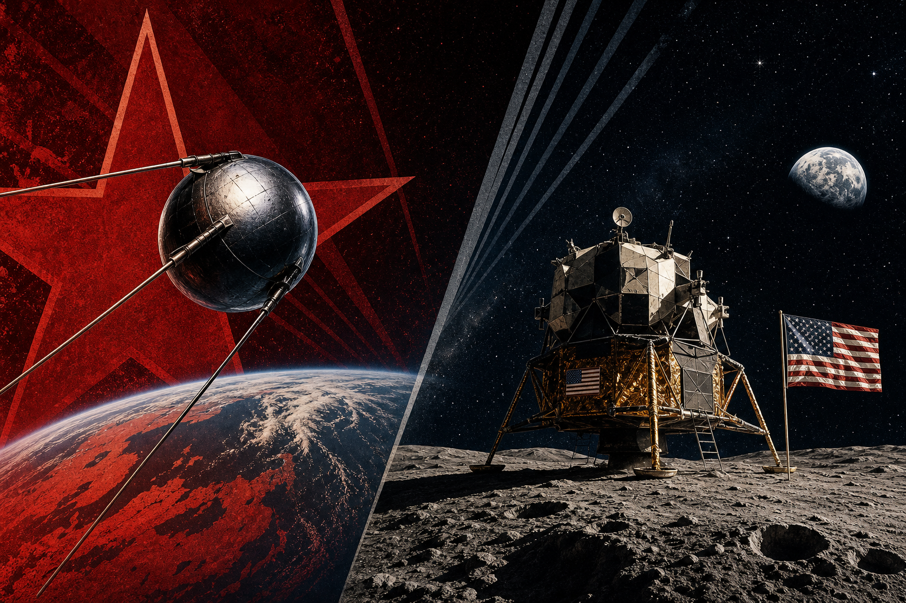

# CrewAI LaTeX Book Generator

**Intelligent Agents — Exercise 03** · Haifa University  
**Renat Karimov** & **Alon Engel** · Group code `anrbj666`

CrewAI multi-agent pipeline that produces a **~15-page LaTeX book** for Exercise 03.

**Book topic:** *The Moon Race: USSR vs US* — from Sputnik and Gagarin through Apollo 11 to the legacy of superpower competition in space.

---

## What this project does

1. **CrewAI agents** (research → outline → chapters → review → build) produce structured JSON artifacts.
2. Python **assembles LaTeX** chapter files deterministically (no hallucinated `.tex`).
3. **MiKTeX / TeX Live** compiles the book to a single PDF.

The default run uses **offline production fixtures** ($0, no API keys). Use `--live` when you want the crew to write a custom topic via LLM.

---

## How to run (Windows PowerShell)

Open PowerShell in the project folder:

```powershell
cd "C:\Users\Ренат\Desktop\Haifa Un\6 is Final\Ai\crewai-latex-book-ex03"
```

### 1. One-time setup per terminal session

```powershell
# Use the source code from this repo (not an old installed copy)
$env:PYTHONPATH = "src"

# Headless matplotlib for the timeline chart
$env:MPLBACKEND = "Agg"

# MiKTeX binaries (adjust if TeX Live is installed elsewhere)
$env:Path = "$env:LOCALAPPDATA\Programs\MiKTeX\miktex\bin\x64;" + $env:Path
```

### 2. Generate the book + PDF (recommended)

```powershell
.\.venv\Scripts\python.exe -m bookgen.main
```

This will:

- write chapter `.tex` files under `latex/chapters/`
- download NASA chapter images into `latex/figures/` (fallback: `assets/chapter-figures/`)
- compile LaTeX with **pdflatex + bibtex** (multiple passes for TOC and citations)

### 3. Open the PDF

**The only output PDF is:**

```
latex/build/main.pdf
```

Open it with:

```powershell
start latex\build\main.pdf
```

> **Do not open `latex/main.pdf`.** That file is not produced by the pipeline. If it exists from an old manual compile, it will have an empty table of contents, broken `[?]` citations, and stale content.

> **Close `latex/build/main.pdf` in your PDF viewer before recompiling**, or the build will fail with a “close the file” message.

### Other useful commands

| Command | When to use |
|---------|-------------|
| `.\.venv\Scripts\python.exe -m bookgen.main --dry-run` | Check config only |
| `.\.venv\Scripts\python.exe -m bookgen.main --demo` | Quick 2-chapter smoke test |
| `.\.venv\Scripts\python.exe -m bookgen.main --compile-only` | Recompile after hand-editing `.tex` files |
| `.\.venv\Scripts\python.exe -m bookgen.main --live` | Live CrewAI crew (API keys, costs money) |

---

## Where files go

| Path | Contents |
|------|----------|
| **`latex/build/main.pdf`** | **Final compiled book (~15 pages)** |
| `latex/chapters/*.tex` | Generated chapter content |
| `latex/figures/*.jpg` | Downloaded NASA images (one per chapter) |
| `latex/figures/mission_timeline.pdf` | Python/matplotlib chart (chapter 4) |
| `latex/references.bib` | Bibliography source |
| `data/sessions/<id>/` | JSON artifacts per run |
| `docs/COST.md` | API cost log |

**Moodle submission PDF** (`anrbj666-ex03.pdf` from the Word template) is created separately by your team — not by this pipeline.

---

## Prerequisites

| Tool | Purpose |
|------|---------|
| **Python 3.11–3.13** | CrewAI does not support 3.14 |
| **MiKTeX or TeX Live** | Compile LaTeX to PDF |
| **`.venv`** (already in repo) | Project dependencies |
| **Internet** (first run) | Download NASA chapter images |
| **API keys** (optional) | Only for `--live` mode |

First compile may take several minutes while MiKTeX downloads LaTeX packages (babel/hebrew, etc.).

---

## Book contents (production run)

1. Cold War Context and the Space Race Begins  
2. Soviet Early Lead: Sputnik and Vostok  
3. American Response: Mercury, Gemini, Apollo  
4. Key Missions and Turning Points  
5. Propaganda, Politics, and Public Opinion  
6. Legacy: Who Won and What Remains  

Each chapter includes:

- English sections with **citations** from `latex/references.bib`
- One **NASA image** (`latex/figures/`)
- A **Hebrew summary** in a separate RTL block at chapter end
- Plus (once in the book): milestones **table**, rocket **equation**, Python **timeline plot**

---

## API usage & cost

See [docs/COST.md](docs/COST.md) (auto-updated after each run).

| Run mode | Typical cost |
|----------|--------------|
| `--demo` | $0.00 |
| default production | $0.00 (~6750 words, Moon Race fixtures) |
| `--live` | Depends on model; logged in `logs/crew_run_*.jsonl` |

---

## Screenshots

Add PNGs under `assets/screenshots/` for submission evidence:

- Table of contents (`toc.png`)
- Sample content page (`sample-page.png`)
- Terminal pipeline output (`pipeline.png`)

See [assets/screenshots/README.md](assets/screenshots/README.md).

---

## Repository layout

```
crewai-latex-book-ex03/
├── assets/                 # Hero image, chapter-figure fallbacks, screenshots
├── config/prompts/         # CrewAI agent YAML prompts
├── docs/                   # PRD, PLAN, TODO, COST.md
├── latex/                  # LaTeX sources
│   ├── build/main.pdf      # ← compiled output (only PDF location)
│   ├── chapters/
│   └── figures/
├── src/bookgen/            # Python package (crew, sdk, reporting)
├── data/sessions/          # JSON artifacts per run (gitignored)
├── logs/                   # crew_run_*.jsonl (gitignored)
└── tests/
```

---

## CrewAI architecture

Five agents · sequential crew (3 LLM tasks in live mode):

`Research Director → Outline Architect → Chapter Writer → [assemble] → Review → Compile`

Gatekeeper wraps every LLM call. Prompts live in `config/prompts/`.

---

## Documentation

- [PRD](docs/PRD.md)
- [PLAN](docs/PLAN.md)
- [TODO](docs/TODO.md)
- [COST](docs/COST.md)

---

## Submission checklist

- [ ] GitHub shared with `rmisegal@gmail.com`
- [ ] `latex/` folder committed (including `latex/figures/` images)
- [ ] `docs/PRD.md`, `PLAN.md`, `TODO.md`, root `README.md`
- [ ] Moodle PDF: `anrbj666-ex03.pdf` from Word template (separate from `latex/build/main.pdf`)
- [ ] Self-grade on Moodle
