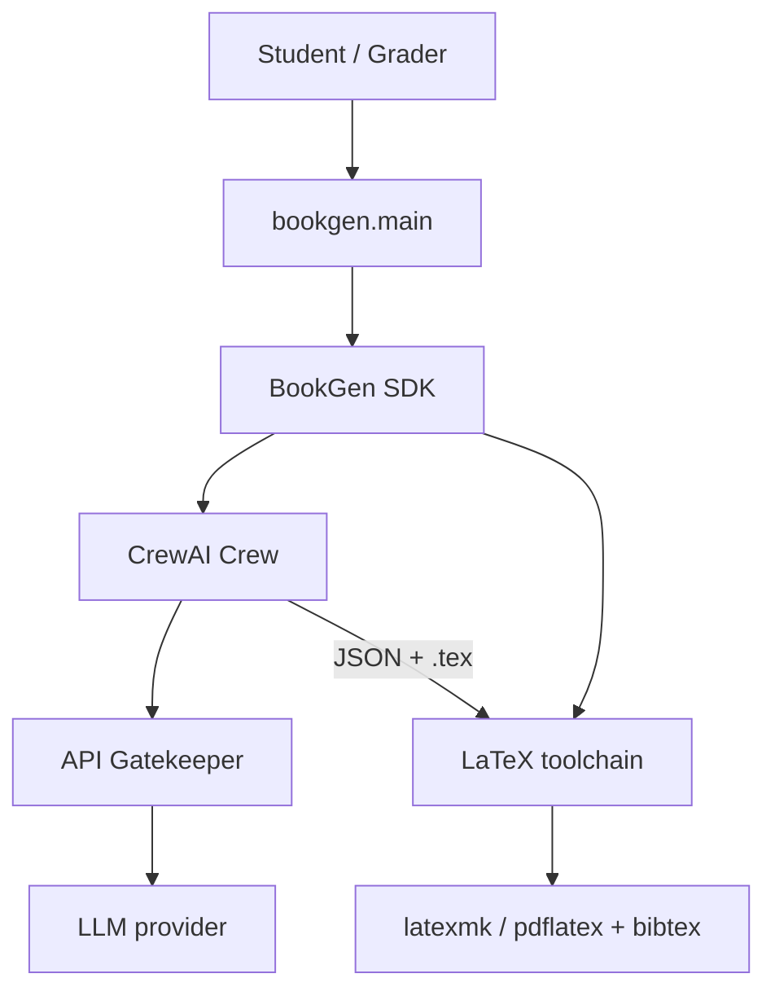
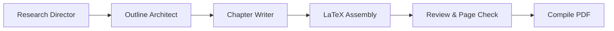
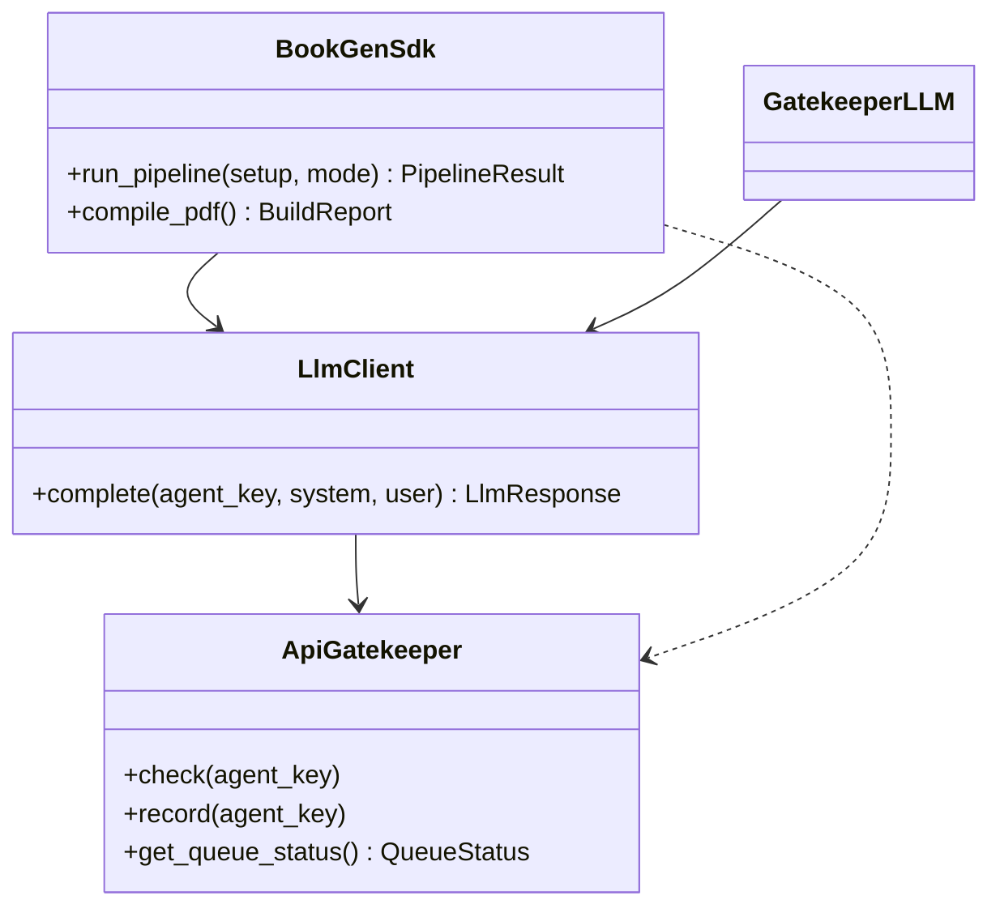

# CrewAI LaTeX Book Generator

**Intelligent Agents — Exercise 03** · University of Haifa
**Renat Karimov** & **Alon Engel** · Group code `anrbj666`
**Course instructor:** Dr. Yoram Segal

A CrewAI multi-agent pipeline that produces a **~15-page LaTeX book** and compiles it to PDF.

**Book topic:** *The Moon Race: USSR vs US* — from Sputnik and Gagarin through Apollo 11 to the legacy of superpower competition in space.

---

## What this project does

1. A **CrewAI crew** (research → outline → chapters → review → build) maps each agent to a job title in a publishing house.
2. Python **assembles LaTeX** chapter files deterministically from structured (Pydantic) data — no hallucinated `.tex`.
3. **latexmk / pdflatex + bibtex** compiles the book to **`latex/build/book.pdf`** (~15 pages, multiple passes so the TOC and citations resolve).

The default run uses **offline production fixtures** ($0, no API keys, bundled NASA images). Use `--live` when you want the crew to write the content via an LLM.

---

## Architecture

### System context (C4 level 1)



### Agent pipeline (sequential crew)



### Object-oriented layering (SDK is the single entry point)



All business logic is reachable through `BookGenSdk`; CLI, crew, and tools delegate to it. Every LLM call is routed through `ApiGatekeeper` (rate-limit waiting + budget cost-guard + JSONL cost logging). The diagrams above are also reproduced inside the book itself (Appendix A, drawn with **TikZ**).

---

## Installation

Requirements:

| Tool | Purpose |
|------|---------|
| **Python 3.11–3.13** | CrewAI does not support 3.14 |
| **uv** | Package manager + task runner (required by the guidelines) |
| **MiKTeX or TeX Live** | Compile LaTeX to PDF (`latexmk`/`pdflatex` + `bibtex` on `PATH`) |

```bash
# from the repository root
uv sync                      # create the environment and install dependencies
cp .env-example .env         # only needed for --live runs (add an API key)
```

> The virtual environment is created by `uv` and is **not** committed (`.gitignore`).
> The first LaTeX build may take a few minutes while MiKTeX auto-installs packages
> (babel/hebrew, tikz, etc.).

---

## Usage

```bash
uv run python -m bookgen.main              # generate chapters + figures, then compile
uv run python -m bookgen.main --dry-run    # validate configs only (no build)
uv run python -m bookgen.main --demo       # quick 2-chapter smoke test
uv run python -m bookgen.main --compile-only   # recompile existing .tex (after editing)
uv run python -m bookgen.main --live       # crew writes content via an LLM (needs API key, costs money)
```

The output PDF is always **`latex/build/book.pdf`**.

> Close `latex/build/book.pdf` in your PDF viewer before recompiling, or the build
> reports "close the file" (Windows locks the open PDF). The build still produces a
> fresh copy under the build folder.

### Compiler choice

The pipeline calls **`latexmk`** when available and otherwise falls back to
**`pdflatex` + `bibtex`** (both ship with MiKTeX/TeX Live). LuaLaTeX/XeLaTeX also
work for the Hebrew blocks; the toolchain is configurable in `config/book.json`.

---

## Configuration

| File | Key settings |
|------|--------------|
| `config/setup.json` | `version`, project name, log/session dirs |
| `config/book.json` | `topic`, `target_pages` (15), `page_tolerance` (2), `words_per_page` (110, calibrated — see `notebooks/`) |
| `config/rate_limits.json` | `version`, per-agent budgets, `requests_per_minute` (→ inter-call wait) |
| `config/prompts/*.yaml` | Agent role / goal / backstory / instructions |

All config files declare `"version": "1.00"`, validated at startup against `src/bookgen/shared/version.py`.

---

## Repository layout

```
crewai-latex-book-ex03/
├── assets/chapter-figures/  # bundled NASA images (offline-first)
├── assets/screenshots/      # PDF + pipeline screenshots (submission evidence)
├── config/                  # setup/book/rate_limits + prompt YAMLs
├── docs/                    # PRD, PLAN, TODO, PROMPTS, COST, mechanism PRDs
├── latex/                   # LaTeX project (main, preamble, chapters, appendix, bib)
│   └── build/book.pdf       # compiled output
├── notebooks/               # words-per-page calibration analysis
├── src/bookgen/             # Python package (sdk, crew, latex, reporting, shared)
└── tests/                   # unit + integration tests
```

---

## Quality

| Check | Command | Status |
|-------|---------|--------|
| Lint | `uv run ruff check .` | 0 violations (E,F,W,I,N,UP,B,C4,SIM) |
| Tests + coverage | `uv run pytest --cov=src/bookgen` | ≥85% (currently ~88%) |
| File size | — | every source file ≤150 code lines |

Tests are fully offline: HTTP providers use `httpx.MockTransport`, image fetching is
injected, and the pipeline runs in fixtures mode with the compile step swapped out.

---

## API usage & cost

Every LLM call is logged to `logs/crew_run_<id>.jsonl` and summarized in
[`docs/COST.md`](docs/COST.md) (auto-written each run).

| Run mode | Typical cost |
|----------|--------------|
| `--demo` / default production | **$0.00** (offline fixtures) |
| `--live` | Depends on model; real token table written to `docs/COST.md` |

---

## Screenshots

Submission evidence lives in [`assets/screenshots/`](assets/screenshots/):
`toc.png` (table of contents), `sample-page.png` (a chapter page with citations),
and `pipeline.png` (terminal output of a run). See the folder README for what to capture.

---

## Documentation

- [PRD](docs/PRD.md) · [PLAN](docs/PLAN.md) (C4 + ADRs) · [TODO](docs/TODO.md)
- [PROMPTS](docs/PROMPTS.md) (prompt-engineering log) · [COST](docs/COST.md)
- Mechanism PRDs: [crew](docs/PRD_crew_orchestrator.md), [latex](docs/PRD_latex_pipeline.md), [gatekeeper](docs/PRD_gatekeeper.md), [llm sdk](docs/PRD_llm_sdk.md)

---

## Submission checklist

- [ ] GitHub shared with `rmisegal@gmail.com` (or public)
- [ ] `latex/` committed (sources + `figures/` + `build/book.pdf`)
- [ ] `docs/PRD.md`, `PLAN.md`, `TODO.md`, `PROMPTS.md`, root `README.md`
- [ ] Screenshots added under `assets/screenshots/`
- [ ] Moodle PDF `anrbj666-ex03.pdf` from the Word template (separate from `book.pdf`)
- [ ] Self-grade submitted on Moodle
```
